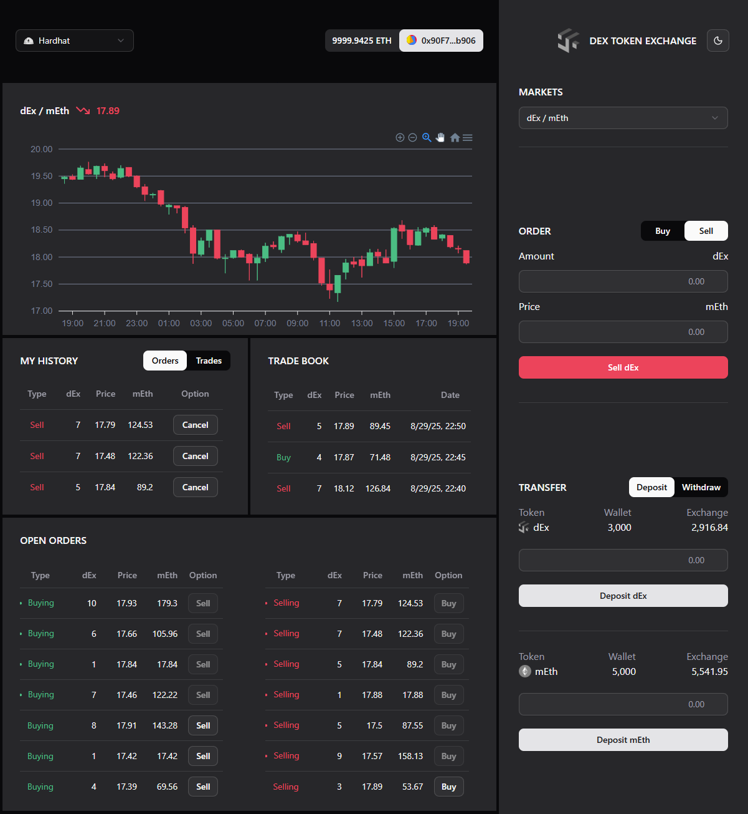
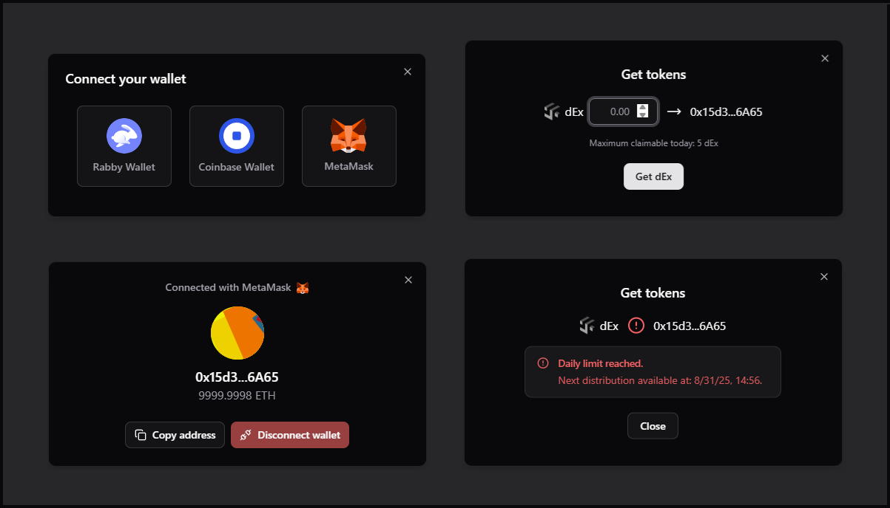

# dEx Token Exchange

[](https://deepwiki.com/edyionescu/dex-token-exchange)


## Overview

This project is a decentralized application (dApp) that implements a token exchange. It allows users to trade different ERC20 tokens in a peer-to-peer manner. The application consists of a smart contract layer and a client-side user interface.

### Workflow

The typical workflow for a user is as follows:

1.  **Connect Wallet:** The user connects their Ethereum wallet to the application.
2.  **Deposit Tokens:** The user deposits the tokens they want to trade into the exchange's smart contract.
3.  **Create Order:** The user creates a new order, specifying the token and amount they want to get and the token and amount they want to give.
4.  **Fill Order:** Another user can see the open orders and choose to fill one.
5.  **Withdraw Tokens:** The user can withdraw their tokens from the exchange at any time.

<br />




## Core Components

### Smart Contract Layer

The smart contract layer is the backbone of the application. It consists of two main contracts:

- **`Exchange.sol`:** This contract handles the core logic of the exchange. It manages user balances, orders, and fees.
- **`Token.sol`:** This is an ERC20 token contract with a faucet feature that allows users to get free tokens for testing purposes.

The smart contracts are developed using Solidity and are deployed on the Hardhat and/or Foundry local networks, as well as the Ethereum Sepolia testnet.

**Stack:** [Solidity](https://soliditylang.org/), [Hardhat](https://v2.hardhat.org/) / [Foundry](https://getfoundry.sh/), [OpenZeppelin](https://openzeppelin.com/).

### Client Component

The client component is a React-based UI that allows users to interact with the smart contracts in a seamless and intuitive way.

**Stack:** [React](https://react.dev/), [Redux Toolkit](https://redux-toolkit.js.org/), [ethers.js](https://docs.ethers.org/v6/), [Tailwind CSS](https://tailwindcss.com/), [shadcn/ui](https://ui.shadcn.com/).

## Development Setup

### Prerequisites

- [Node.js](https://nodejs.org/): >=22.0.0

### Usage

1.  Clone the repository:

    ```bash
    git clone https://github.com/edyionescu/dex-token-exchange.git
    ```

2.  Install the dependencies for the client:

    ```bash
    cd client
    npm install
    ```

3.  Install the dependencies for the smart contracts:

    ```bash
    cd ../contracts
    npm install
    ```

### Running the Application

1.  Start the local blockchain:

    ```bash
    cd contracts
    npm run node # Hardhat node (default)
    npm run node-foundry # Optional
    ```

2.  Deploy the smart contracts:

    ```bash
    cd contracts
    npm run deploy # Hardhat deployment
    npm run deploy-foundry # Optional
    ```

3.  Seed the exchange with initial liquidity:

    ```bash
    cd contracts
    npm run seed # Hardhat seeding
    npm run seed-foundry # Optional
    ```

4.  Start the client:

    ```bash
    cd ../client
    npm run dev
    ```

5.  Visit the application at [`http://localhost:5173/`](http://localhost:5173/).
